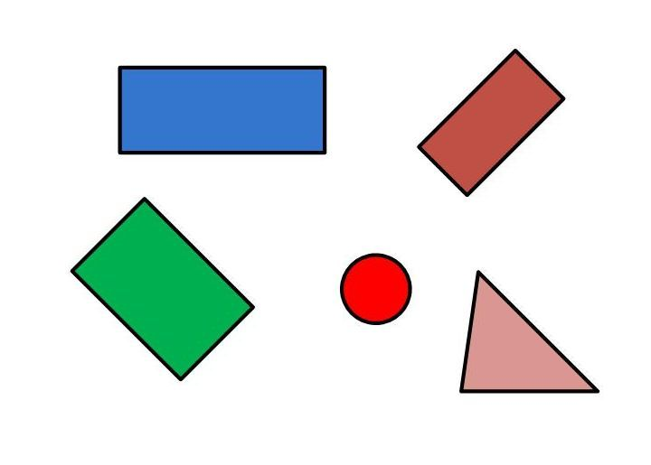
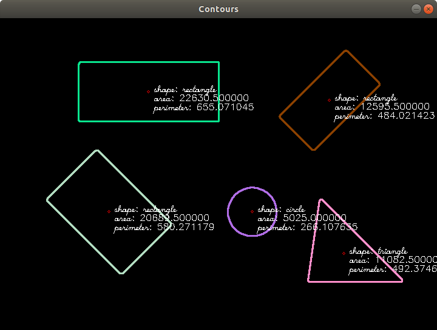

# project_iunu

## Overview
this code recognize geometric shapes, and compute some shape primitives: center, area and perimeter.

**Author: [Agustin Ortega](https://github.com/agusorte), aortega.jim@gmail.com**

-

## Dependences

- [CMake] (http://www.cmake.org/) 
- [OpenCV](http://opencv.org/) (computer vision library),

## 1. Clone repository
	git clone https://github.com/agusorte/iunu

## 2. Compilation

	mkdir build && cd build && cmake ..
	make

## 3. Running

Executable is inside the folder bin

you can run as

	./bin/ShapeRecognition ../shapes.jpg

## 4. Comments

More geometric shapes can be added, also segmentation in this case is simple,  different when background is to similar than foreground.

